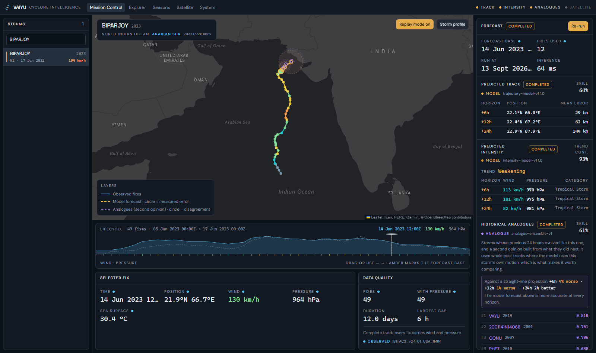
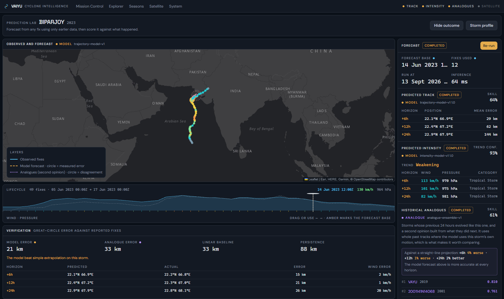
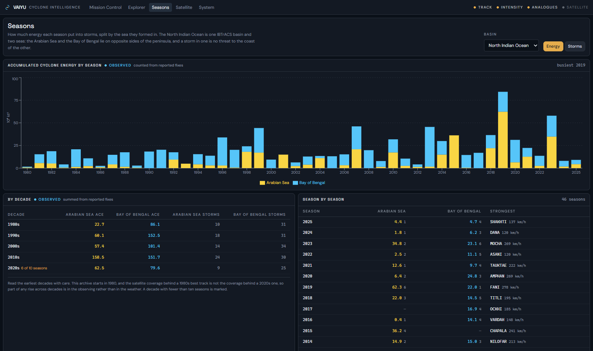
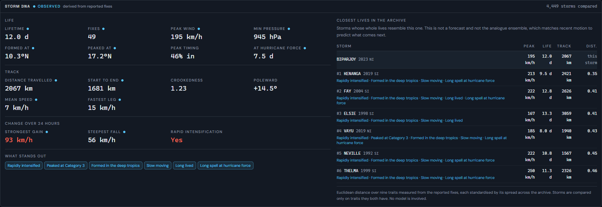

<div align="center">

# 🌀 VAIYU

### Tropical cyclone intelligence: forecasts you can check

Neural-network track and intensity forecasts, 46 years of storm history,<br>
and a lab that scores every prediction against what actually happened.

<br>


<br>


[**Getting started**](#getting-started) · [**How accurate is it?**](#how-well-the-models-forecast) · [**Data & models**](docs/data-and-models.md) · [**Deploy**](DEPLOYMENT.md)

</div>

<br>



> **Nothing on screen is invented.** A measured value, a model output and a
> missing value are each drawn differently, and a missing one appears as a dash, never
> as a plausible guess. When a capability isn't available, VAIYU says so and
> explains why.

---

## What it does

- 🎯 **Track & intensity forecasts**: +6, +12 and +24 hour predictions from GRU
  neural networks, each drawn with its measured error.
- 🧪 **Prediction Lab**: rewind any storm, forecast from what was knowable then,
  reveal what really happened, and score the result against simple baselines.
- 🕰️ **Historical analogues**: the past storms whose last 24 hours looked most
  like this one, as a second opinion beside the model.
- 🧬 **Storm DNA**: a storm's whole life reduced to nine measured traits and
  compared against all 4,450 storms in the archive.
- 📊 **Seasons**: storm counts and Accumulated Cyclone Energy year by year, with
  the North Indian Ocean split into the **Arabian Sea** and **Bay of Bengal**.
- 🗺️ **Explorer**: every storm from 1980 to 2026, searchable by name, basin, sea
  and season.

| Prediction Lab | Seasons |
| --- | --- |
|  |  |



---

## How well the models forecast

Measured on **668 storms the models never saw in training**, against the two
forecasts anyone gets for free: *persistence* (the storm stops moving) and
*linear extrapolation* (it keeps its last 6 hours of motion). Beating the second
is what shows a model has learned how storms actually turn.

| Track error | Model | Straight line | Persistence |
| --- | --- | --- | --- |
| +6 h | **28.6 km** | 31.0 km | 105.0 km |
| +12 h | **61.8 km** | 69.0 km | 206.0 km |
| +24 h | **143.7 km** | 166.3 km | 399.6 km |

| Intensity | Model | Persistence |
| --- | --- | --- |
| Wind error, +24 h | **18.0 km/h** | 26.0 km/h |
| Pressure error, +24 h | **7.8 hPa** | 10.8 hPa |
| Trend (weakening / stable / intensifying) | **68.0%** | 42.1% |

The track model beats a straight line in all six ocean basins at +24 h, by 6–18%.
The full evaluation (per basin, with pressure withheld, the analogue ensemble,
what did *not* help and why) is in
**[docs/data-and-models.md](docs/data-and-models.md)**.

---

## Architecture

```text
React console (TanStack Start, Leaflet, Recharts)            :5173
        │  REST: the only network calls the browser makes
        ▼
Spring Boot 3.2 · Java 17                                    :8081
        │                          │
        │ JPA + Flyway             │ server-to-server only
        ▼                          ▼
PostgreSQL                   FastAPI AI service              :8000
  4,450 storms                     │
  111,960 observations             ▼
  stored forecast runs       PyTorch models
                               track GRU · intensity GRU · analogue index
```

The browser never talks to the AI service. Spring Boot owns validation,
persistence and every decision about what is fit to show, so the models can be
retrained or restarted without the console losing its history.

| Directory | What is in it |
| --- | --- |
| [`frontend/`](frontend) | The console: TanStack Start, React 19, TypeScript, Tailwind |
| [`backend/`](backend) | Spring Boot API, Flyway migrations, archive ingestion |
| [`ai-service/`](ai-service) | FastAPI service, PyTorch models, data preparation and training |
| [`scripts/`](scripts) | One-command local start, stop and archive loading (Windows) |
| [`deploy/`](deploy) | Production reverse proxy and environment template |
| [`docs/`](docs) | Data and model write-up, architecture, development guide |

---

## Getting started

### Prerequisites

Java 17 · Maven 3.9 · Node.js 20+ · Python 3.11+ · PostgreSQL 14+

### 1. Clone and create the database

```bash
git clone https://github.com/aditya-dalal-24/VAIYU.git
cd VAIYU
psql -U postgres -c "CREATE DATABASE vaiyu;"
```

The schema is created automatically by Flyway the first time the backend starts.

### 2. Get the trained models and the storm archive

These are not stored in git. Choose one:

**Download them** (fast): from this repository's
[Releases](https://github.com/aditya-dalal-24/VAIYU/releases), download `vaiyu-models-and-data.zip` and unzip it at
the repository root. It fills in `ai-service/checkpoints/` and
`ai-service/data/processed/observations.csv`.

**Or build them yourself** (about an hour on a CPU): follow *Training from
scratch* in [`ai-service/README.md`](ai-service/README.md). It downloads the
IBTrACS archive and the NOAA sea-surface temperature data, prepares the
observation table and trains all three models.

### 3. Install dependencies

```bash
cd ai-service && python -m venv .venv
.venv/Scripts/pip install -r requirements.txt      # macOS/Linux: .venv/bin/pip
cd ../frontend && npm install
cd ..
```

### 4. Configure the backend

```bash
cp backend/.env.example backend/.env
```

Edit `backend/.env`: set `DB_PASSWORD` to your PostgreSQL password, and set
`VAIYU_ADMIN_TOKEN` to a random value of at least 24 characters, for example the
output of `openssl rand -hex 32`. The token protects archive loading.

### 5. Run it

**On Windows**, one command builds whatever is missing and starts all three
services in the background:

```powershell
powershell -ExecutionPolicy Bypass -File scripts\start-local.ps1
powershell -ExecutionPolicy Bypass -File scripts\ingest-local.ps1   # first run only: loads the archive
```

Open **http://localhost:5173**. Stop everything with `scripts\stop-local.ps1`;
after changing code, start again with `-Rebuild`. The whole stack uses about
600 MB of memory.

**On macOS or Linux**, run each service in its own terminal:

```bash
# 1: AI service
cd ai-service && .venv/bin/python -m uvicorn app.main:app --port 8000

# 2: backend (reads backend/.env)
cd backend && mvn spring-boot:run

# 3: console
cd frontend && npm run dev

# then, once, load the archive
curl -X POST -H "X-Admin-Token: <your token>" http://localhost:8081/api/internal/ingest/ibtracs
```

Loading the archive takes about 30 seconds and is safe to repeat.

---

## Deploying

[**DEPLOYMENT.md**](DEPLOYMENT.md) walks through running VAIYU on a single Linux
server with Docker Compose and automatic HTTPS, including which ports stay
private and how secrets are handled. The Docker images have not yet been built
end to end; that guide says so where it matters.

---

## Testing

```bash
cd ai-service && .venv/Scripts/python -m pytest     # 340 tests
cd backend    && mvn test                           # 80 tests
cd frontend   && npm run typecheck && npm run lint
```

The tests most worth reading pin *honesty* rather than behaviour: that no
environmental data is invented when none was measured, that a missing pressure
is never scored as "no change", that a storm with no forecast yet (204) is
distinguished from a storm that does not exist (404), and that a filter can
never again silently delete a whole basin's history.

---

## Known limitations

- **Satellite analysis is not trained.** The vision model's architecture and
  training pipeline are complete, but no imagery has been obtained, so every
  satellite request reports *not available* with a reason.
- **It is not a warning system.** The archive ends at its last recorded fix;
  there is no live feed and no alerting.
- **No landfall risk or impact scoring.** That needs coastline, population and
  infrastructure data this project does not have, and a number computed without
  them would look authoritative and mean nothing.
- **Environmental inputs are partial.** Sea-surface temperature is joined from
  monthly NOAA data and, measured on held-out storms, does not improve the
  forecasts. Humidity and wind shear are not joined at all.
- **Forecasts reach 24 hours.** Longer range is not attempted.

---

## Data sources

- **Storm tracks**: IBTrACS v04r01, NOAA National Centers for Environmental
  Information. Knapp, K. R., M. C. Kruk, D. H. Levinson, H. J. Diamond, and
  C. J. Neumann (2010): *The International Best Track Archive for Climate
  Stewardship (IBTrACS)*. Bulletin of the American Meteorological Society, 91,
  363–376.
- **Sea-surface temperature**: NOAA Extended Reconstructed SST, version 5.
  Huang, B., et al. (2017): *Extended Reconstructed Sea Surface Temperature,
  Version 5 (ERSSTv5)*. Journal of Climate, 30, 8179–8205.
- **Basemap**: Esri, HERE, Garmin, © OpenStreetMap contributors.

Model forecasts shown in VAIYU are research output, not official forecasts from
any meteorological agency.

---

## License

Released under the [MIT License](LICENSE): free to use, modify and share, as long
as the copyright notice is kept.
